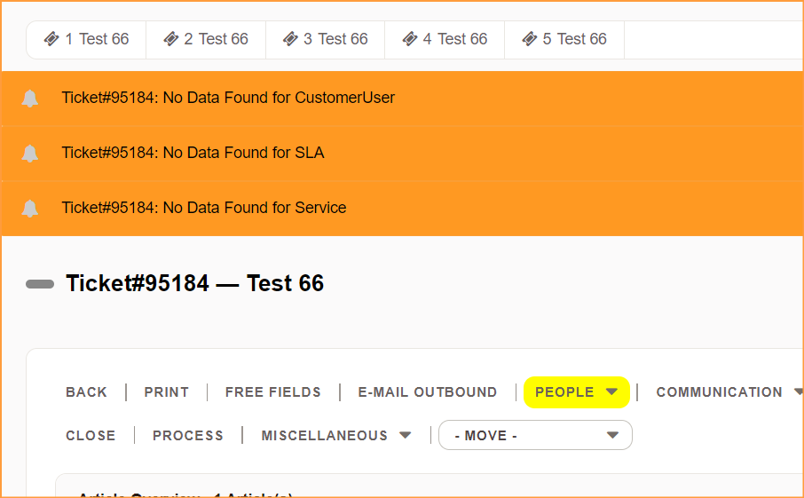

# Znuny AgentTicketZoom Notice

- Display notice in agent ticket zoom screen about missing ticket attributes.
- Default come with Customer User, Service and SLA check.

1. Go to Admin > System Configuration > Frontend::NotifyModule###881-AgentTicketZoomNotice

		Set 1 to Enable
		Set 0 to Disable
	
	
	You also may add a check on specific dynamic field value.
	E.g:
	
		DynamicField_RelatedComputer => 1
			
			
